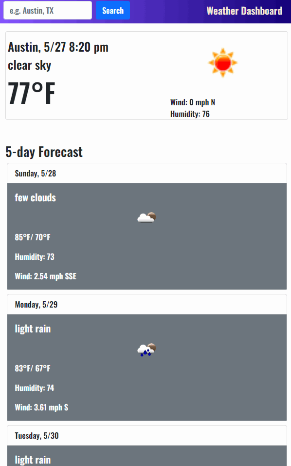
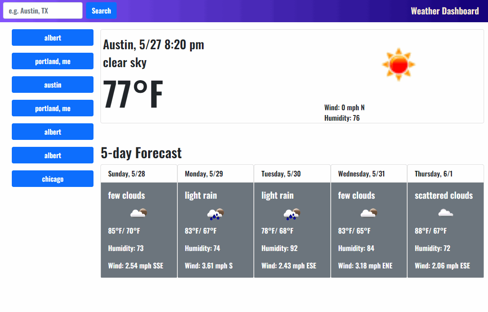

# wwwweather
## a simple geolocating weather forecast deal

This is a weather app that has a responsive bootstrap and jquery interface.

It fetches a geoloction and then weather data from [openweathermap.org](https://hopenweathermap.org) and displays it thusly:

The deployment on github pages is here: [wwwweather](https://stanjosh.github.io/wwwweather/)

## problems

JavaScript is client side, so I left my api key in there like a dum-dum. There's probably a way to make environment variables work in github pages, but I'm not going to worry about it this time.

## credits
big ups to documentation

## license
[MIT](https://choosealicense.com/licenses/mit/)